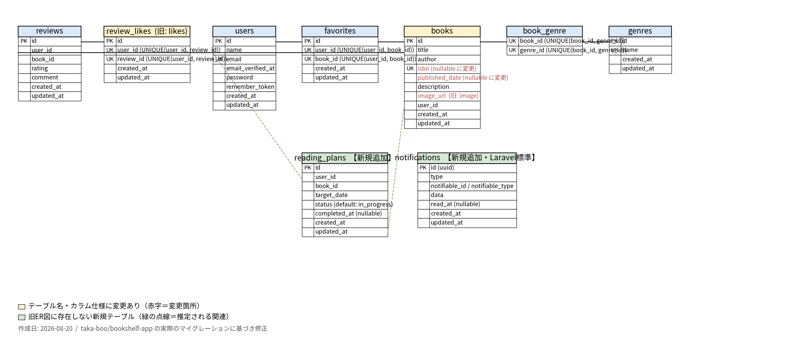

# BookShelf 書籍レビューアプリ

## 概要

書籍の登録・レビュー投稿・お気に入り管理・ランキング表示ができるWebアプリケーションです。
ジャンルによる分類、レビューへのいいね機能、読書計画機能、リマインダー通知機能を備えています。
外部アプリケーション向けの公開API（JSON）も提供しています。

## ER図



## 環境構築手順

### 1. リポジトリをクローン

```bash
git clone <リポジトリURL>
cd bookshelf-app
```

### 2. 環境変数を設定

cp .env.example .env
.envファイルに以下を追加してください。
GOOGLE_BOOKS_API_KEY=あなたのAPIキー
Google Books APIキーは Google Cloud Console で...

### 3. Dockerコンテナを起動

```bash
./vendor/bin/sail up -d
```

### 4. パッケージのインストール

```bash
sail composer install
sail npm install
```

### 5. アプリケーションキーの生成

```bash
sail artisan key:generate
```

### 6. データベースの作成とマイグレーション

```bash
sail artisan migrate --seed
```

### 7. テスト用データベースの作成

```bash
sail mysql
```

`mysql>` が出たら以下を実行してください。

```sql
CREATE DATABASE IF NOT EXISTS testing;
exit
```

### 8. 開発サーバーの起動

```bash
sail npm run dev
```

### 9. アプリケーションにアクセス

ブラウザで http://localhost にアクセスしてください。

## 使用技術

| 技術                  | バージョン                |
| --------------------- | ------------------------- |
| PHP                   | 8.5                       |
| Laravel               | 10.x                      |
| MySQL                 | 8.4                       |
| Docker / Laravel Sail | -                         |
| Vite / Tailwind CSS   | -                         |
| Laravel Fortify       | 認証                      |
| Laravel Sanctum       | APIトークン認証           |
| Google Books API      | ISBN検索                  |
| PHPUnit               | テスト（カバレッジ97.1%） |

## APIエンドポイント一覧

### 読み取り系（認証不要）

| メソッド | パス                 | 概要                                             |
| -------- | -------------------- | ------------------------------------------------ |
| GET      | /api/v1/books        | 書籍一覧（検索・フィルタ・ページネーション対応） |
| GET      | /api/v1/books/{book} | 書籍詳細（ジャンル・レビュー含む）               |

### 書き込み系（Sanctumトークン認証必須）

| メソッド | パス                 | 概要                   |
| -------- | -------------------- | ---------------------- |
| POST     | /api/v1/books        | 書籍登録               |
| PUT      | /api/v1/books/{book} | 書籍更新（所有者のみ） |
| DELETE   | /api/v1/books/{book} | 書籍削除（所有者のみ） |

## テスト

```bash
sail artisan test
sail artisan test --coverage
```

## 作成者

綾部 貴之

## 開発環境URL

http://localhost
